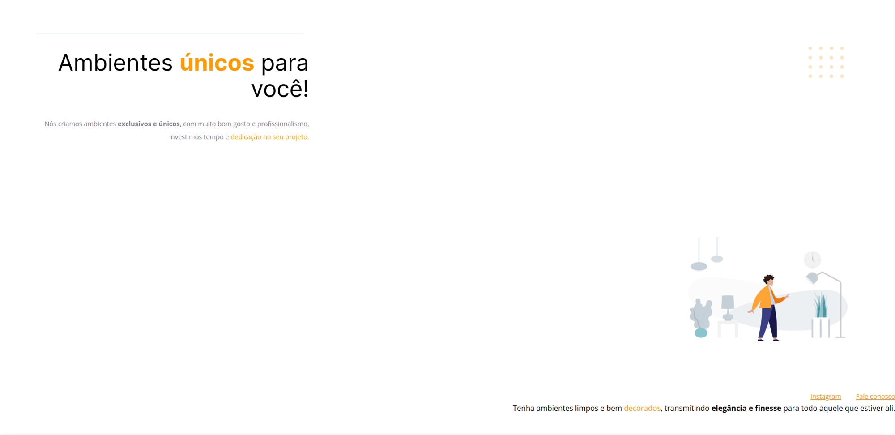

<h1 align="center"> Móveis Customizados - Corrigindo Bugs</h1>

Exercício de correção de bugs. 
Neste desafio recebemos um código bagunçado e o objetivo era ajusta-lo de acordo com o layout. 

A imagem abaixo representa a página bagunçada, e na seção Projeto você pode verificar o resultado final do desafio. 
  

  <a href="#-tecnologias">Tecnologias</a>&nbsp;&nbsp;&nbsp;|&nbsp;&nbsp;&nbsp;
  <a href="#-projeto">Projeto</a>&nbsp;&nbsp;&nbsp;|&nbsp;&nbsp;&nbsp;
  <a href="#-layout">Layout</a>&nbsp;&nbsp;&nbsp;|&nbsp;&nbsp;&nbsp;
  <a href="#-agradecimentos">Agradecimentos</a>

 

## 🚀 Tecnologias

Esse projeto foi desenvolvido com as seguintes tecnologias:

- HTML
- CSS
- Git e Github
- Figma

## 💻 Projeto

- [Clique aqui para acessar o meu projeto finalizado.](https://moveiscustomizados-fixbugs.vercel.app/)

## 🔖 Layout

Você pode visualizar o layout original do projeto através [DESSE LINK](https://www.figma.com/file/fAvYZz4dPV5MfhL77XkqkD/Explorer---Projeto-01?node-id=0%3A1&mode=dev). É necessário ter conta no [Figma](https://figma.com) para acessá-lo.

## 💜 Agradecimentos

Um agradecimento especial a <b>Rocketseat</b> por todos os projetos educacionais e por estimular o aprendizado em comunidade. 🚀
[Participe da nossa comunidade!](https://discord.gg/rocketseat)
